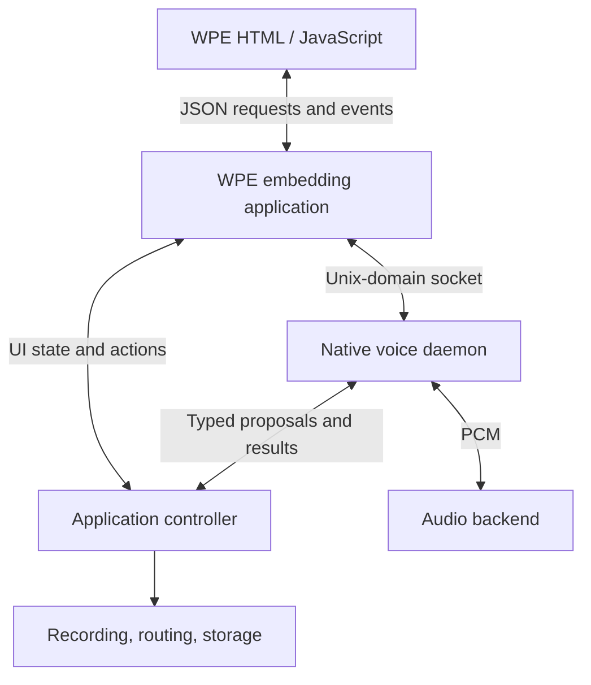
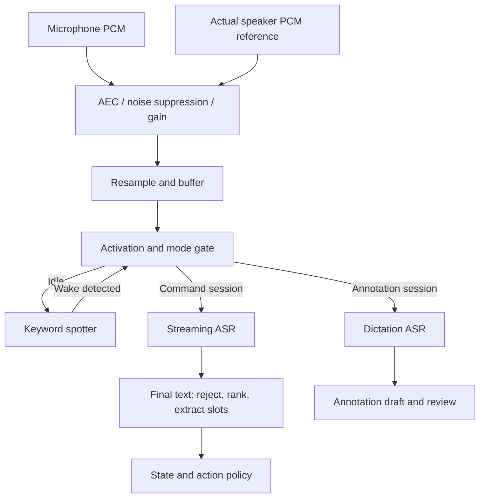
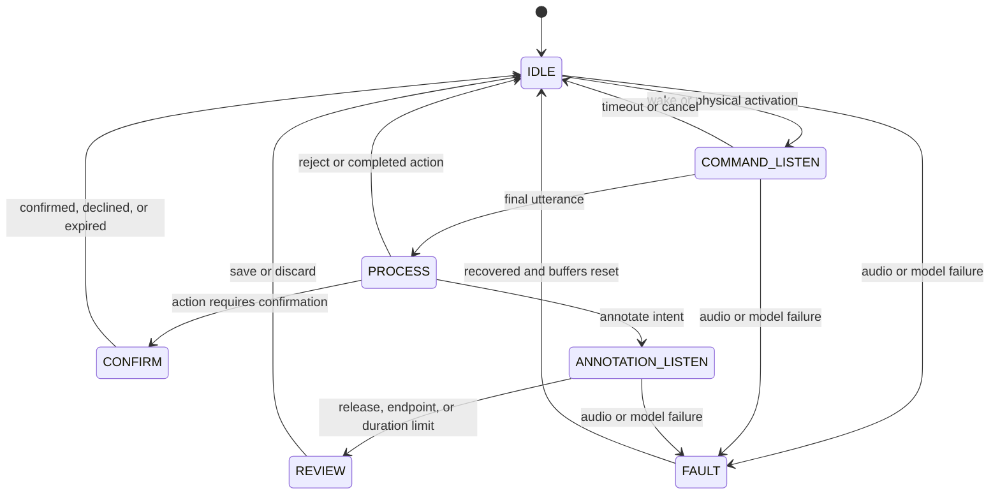
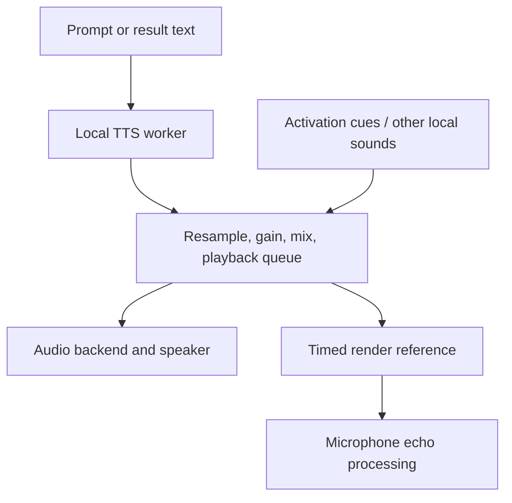

# Custom Linux + WPE WebKit: offline voice input and output recipe

**Purpose:** add voice commands, spoken annotations, and speech output to a Linux touchscreen appliance while minimizing unintended actions from nearby conversation.

**Recommended starting point:** a native C++ voice daemon using ALSA, sherpa-onnx, and a small deterministic command policy, connected to the WPE embedding application over a Unix-domain socket. Start with explicit activation and half-duplex interaction; add simultaneous listening and speaking after validating echo cancellation.

This is an implementation recipe and proposed architecture, not tested firmware. Exact models, thread counts, RAM use, and latency must be selected on the target SoC. Source links were checked on 2026-10-06; pin the versions actually qualified for the product.

## 1. Components and responsibilities

| Component | Starting choice | Responsibility |
| --- | --- | --- |
| Audio device access | ALSA | Capture microphone PCM and play speaker PCM |
| Audio processing | WebRTC Audio Processing Module, AEC3 | Echo cancellation, noise suppression, optional gain control |
| Activation | sherpa-onnx keyword spotting; touch/button/footswitch alternative | Open a bounded voice interaction |
| Speech segmentation | Silero VAD through sherpa-onnx plus ASR endpointing | Detect speech and determine utterance boundaries |
| Command recognition | sherpa-onnx streaming Zipformer | Produce partial and final transcripts |
| Annotation recognition | Initially the same ASR; optionally whisper.cpp | Transcribe dictation into a draft |
| Intent matching | Rules and aliases first; optional small ONNX sentence encoder | Rank supported intents and resolve known entities |
| Execution policy | Native application controller | Validate action, current state, target, and confirmation |
| Speech output | Compatible Piper/VITS voice through sherpa-onnx | Generate short local prompts |
| Optional richer speech | Compatible Kokoro model through sherpa-onnx | Longer responses if hardware benchmarks permit |
| UI integration | WPE script messages and native-to-JS events | Present status, transcripts, drafts, and results |

sherpa-onnx provides local streaming/non-streaming ASR, VAD, keyword spotting, TTS, and C/C++ APIs across Linux architectures [1]. Its TTS documentation includes VITS/Piper and Kokoro models [2]. Select a compatible model package, not an arbitrary ONNX file.

ALSA is the direct-device default in this design. If the platform already uses PipeWire or GStreamer, integrate through that audio owner rather than opening the same device competitively. Keep one authoritative capture/playback path and obtain the speaker reference from it.

## 2. Process architecture



The voice daemon owns microphone processing, inference, interaction states, and speech playback. The application controller owns actual device state and applies actions. WPE displays the interaction and supports manual operation.

Keep the voice daemon outside the WebKit processes. A renderer reload should not leave a stale command pending; a voice fault should not prevent touch operation. Heavy inference runs in workers, away from audio callbacks and the WPE main loop.

Here, “pipes” means audio and message pipelines. For production IPC, use a framed Unix socket or a typed D-Bus interface. Shell pipelines and named FIFOs are useful for experiments but lack the request lifecycle needed for device control.

## 3. Voice input pipeline



### Audio framing

- Negotiate the actual hardware format; 48 kHz capture/playback is a reasonable starting design if supported.
- Use the processing library's required block size. WebRTC APM uses approximately 10 ms blocks: 480 samples per channel at 48 kHz, or 160 at 16 kHz [3].
- Resample cleaned audio to the ASR model's documented input rate; 16 kHz mono is common, not universal. Do not label 48 kHz samples as 16 kHz.
- Adapt APM frames to each VAD/KWS/ASR input requirement. They need not share one frame size.
- Preserve continuous timing. VAD may guide endpointing or idle compute savings, but aggressively removing silence or dropping quiet frames can damage streaming decoding and wake detection.
- Maintain a short RAM ring buffer, initially about one second, to avoid losing the command immediately following the wake phrase. Use the wake span/timestamps where available to trim activation audio; avoid blindly stripping matching words from arbitrary dictation.
- Bound every queue. Audio overruns or model backlog invalidate the current turn; report a recoverable fault instead of executing delayed speech.

Partial transcripts are for UI feedback only. Execute a command only after a finalized utterance passes all policy checks.

## 4. Activation and background-conversation rejection

Require either a distinctive wake phrase, such as **“Hey MediCapture,”** or an explicit touch/button/footswitch activation. A generic phrase like “start recording” should not double as activation.

The idle system processes audio locally for wake detection without transcribing or storing whole-room conversation. Activation opens one bounded turn and produces a visible microphone indicator plus a short audible cue. Return to idle after the action, rejection, or timeout.

sherpa-onnx KWS supports custom keyword sequences, keyword boosting, and trigger thresholds [4]. Generate tokens with the matching model vocabulary. Tune the detector with room recordings; boosting can increase both detections and false alarms. A name containing “3M” describes parameter count, not a guaranteed 3 MB model package.

Activation is evidence of an interaction, not proof of the correct speaker or authorization. Nearby people can say the wake phrase, answer a prompt, or play it from another device. If stronger protection is needed, use physical activation or confirmation; speaker verification and microphone direction are supplementary signals.

After activation, still reject:

- Unrelated speech or unsupported requests: “What time is lunch?”
- Descriptions and quotations: “John said start recording yesterday.”
- Negation: “Do not stop recording.”
- Unresolved corrections or multiple actions: “Start—no, stop recording.”
- Missing or conflicting targets: “Put that one over there.”

Keep an explicit `NONE` / out-of-domain result. A ranker always finds a nearest item; that item may be irrelevant.

## 5. Interaction state machine



All states also support physical cancel/mute. Any fault clears executable proposals; annotation drafts may be retained as incomplete text for review. Restart recovery always begins idle, with a new session identity.

| State | Allowed interpretation | Completion rule |
| --- | --- | --- |
| `IDLE` | Activation only | Wake phrase or physical trigger |
| `COMMAND_LISTEN` | One supported request | Endpoint; initial speech-start timeout around 5 s |
| `PROCESS` | Final transcript and bounded policy | Propose, reject, or enter another mode |
| `ANNOTATION_LISTEN` | Dictation; no command execution | Physical release/stop, silence endpoint, or duration cap |
| `REVIEW` | Save/discard draft | Touch/button confirmation by default |
| `CONFIRM` | Response bound to one pending action | Explicit response before expiry |
| `FAULT` | Status and manual control | Successful recovery |

These timings are initial UX settings, not validated thresholds. Separate the wait-for-speech timeout from maximum utterance duration. Do not carry the activation grant into indefinite follow-up listening.

## 6. Annotation modes

### Free dictation

1. User says “Hey MediCapture, add annotation.”
2. Validate the current recording/procedure target, then enter annotation mode and show the target.
3. User dictates: “Recording stopped briefly because the camera disconnected.”
4. Store the final text as a draft. The words “recording stopped” cannot invoke a command here.
5. Present the text for review; save it only to the bound target after approval.

Prefer hold-to-dictate when people talk nearby. For hands-free dictation, use one bounded segment with silence endpointing and a duration limit, initially perhaps 30 s. Ambient speech during an open annotation session can still enter the draft.

Physical stop/cancel avoids confusing dictation with control words. If a spoken terminator is needed, reserve a distinctive phrase, document that it cannot be dictated literally without an escape mechanism, and test it independently. Do not run the general command matcher inside dictation mode.

### Predefined annotation labels

For a catalog such as `lesion_visible`, `bleeding_observed`, or `image_quality_poor`, enter a separate annotation-label mode and rank spoken text against that catalog. Offer the matching label and original transcript for review. Use `NONE` when no label fits; do not silently replace uncertain free dictation with a catalog entry.

The label matcher may reuse embeddings, but label results always go to annotation storage, never the command executor.

Optional whisper.cpp can re-transcribe a captured annotation segment if target benchmarks justify it. It provides local C/C++ transcription and a microphone stream example [5]. Evaluate it against the streaming model on actual annotation audio; higher accuracy is not guaranteed for every language or domain.

## 7. Command catalog and slot definitions

Store definitions as versioned data. Keep action IDs, examples, entities, requirements, and confirmation policy together.

```json
{
  "schema_version": 1,
  "commands": [
    {
      "id": "start_recording",
      "examples": ["start recording", "begin recording", "record now"],
      "action_aliases": ["start", "begin"],
      "required_slots": [],
      "preconditions": ["recording_state == idle", "storage_ready"],
      "confirmation": "none"
    },
    {
      "id": "stop_recording",
      "examples": ["stop recording", "finish this recording"],
      "action_aliases": ["stop", "finish", "end"],
      "required_slots": [],
      "preconditions": ["recording_state == active"],
      "confirmation": "physical"
    },
    {
      "id": "route_video",
      "examples": ["show endoscope on the main monitor", "send camera two to monitor two"],
      "action_aliases": ["show", "route", "send", "switch"],
      "required_slots": ["source", "destination"],
      "preconditions": ["source_available", "destination_available"],
      "confirmation": "policy"
    }
  ],
  "entities": {
    "source": {
      "endoscope": ["endoscope", "scope camera"],
      "camera_2": ["camera two", "camera 2"]
    },
    "destination": {
      "main_monitor": ["main screen", "main monitor"],
      "monitor_2": ["monitor two", "second display"]
    }
  }
}
```

This schema is proposed application data, not a sherpa-onnx configuration format. Preconditions are named checks implemented in code; do not execute configuration strings as expressions.

Resolve entities to stable device IDs and require a unique match. Normalize “two/2/too” only within a known numbered-entity pattern; global substitution corrupts ordinary language. An omitted destination may use an explicitly configured, displayed default; otherwise ask for it.

Routing policy must reflect the actual display role. Changing a main display is not automatically a low-impact action. Destructive commands such as deleting recordings should be disabled by voice in the initial implementation.

## 8. Ranking and rejection recipe

Start with a small grammar, verb aliases, and entity extraction. Add semantic matching only where tests show it improves useful paraphrases.

For semantic matching, precompute normalized vectors for each intent example and embed each final transcript once. A starting intent score is the maximum cosine similarity across its examples. A small sentence encoder such as `all-MiniLM-L6-v2` is a candidate for English; its model card specifies tokenization and pooling [6]. Use a language-appropriate model for multilingual speech. A raw transformer ONNX output is not automatically a sentence embedding.

Use explicit action and negation checks to distinguish start/stop/pause/resume; these phrases can be close in embedding space. Lexical or fuzzy matching helps with entity aliases but cannot override contradictory action words.

An optional ranking heuristic is:

```text
rank_score(intent) =
    0.55 * semantic_example_score
  + 0.30 * action_and_lexical_score
  + 0.15 * slot_evidence_score
```

These weights are placeholders. Normalize features consistently and fit/tune them against held-out data. Keep activation, negation, out-of-domain rejection, mandatory slots, and application preconditions as separate gates.

**A similarity or weighted score is not a probability.** Do not call `0.91` “91% confidence” unless a calibrated model supports that interpretation. A shared ASR score added to every intent does not change their ranking. N-best transcripts and usable acoustic scores are optional decoder capabilities; verify the selected API before depending on them.

### Decision procedure — pseudocode

```python
def handle_final(turn, app):
    if not turn.activation_valid or turn.expired or not turn.audio_valid:
        return reject("invalid_turn")

    if turn.mode == "annotation":
        return make_annotation_draft(turn.target_id, turn.text)

    if is_out_of_domain(turn.text) or has_unresolved_negation_or_correction(turn.text):
        return reject("not_a_supported_command")

    candidates = rank_commands(turn.text)  # compare distinct intents
    best, second = top_two(candidates)
    if not passes_calibrated_score_and_margin(best, second):
        return clarify_or_reject(candidates)

    slots = resolve_required_slots(best.intent, turn.text)
    if not slots.complete_and_unique:
        return clarify_or_reject(slots)

    # Never convert a disallowed recognized command into the next-best action.
    if not app.preconditions_hold(best.intent, slots):
        return reject("invalid_application_state")

    proposal = bind_to_turn_target_and_state(best, slots, turn, app)
    return request_confirmation(proposal) if requires_confirmation(proposal) else submit(proposal)
```

Test `NONE` using real conversational negatives, including command-like phrases. Merely embedding a few negative examples is not a reliable universal rejection classifier. Use explicit rules first, then optionally train a small intent/OOD classifier on labeled positives and hard negatives.

Require both an acceptance threshold and separation from the next distinct intent. Select thresholds per intent when needed. Do not copy example values such as `0.85` and `0.15` into production without measurement.

UI context can help interpretation, but authoritative controller state gates execution. If “stop recording” is invalid while idle, reject or explain it; do not remove it before ranking and accidentally choose “start recording.”

## 9. Vocabulary feedback into ASR

Build a modest domain vocabulary from device/source names and common terms: “MediCapture,” “endoscope,” “laparoscope,” “multiview,” and configured monitor names.

sherpa-onnx contextual biasing depends on the chosen recognizer and decoder. Its documented transducer hotword path uses `modified_beam_search`; the default greedy decoder does not support that path [7]. Verify the selected model's support and benchmark boosting strength.

Hotwords improve the chance of recognizing terminology; they do not establish that speech was addressed to the device. Excessive boosting can pull unrelated audio toward supported commands. Keep a freer vocabulary for dictation and validate domain spellings in both modes.

## 10. Voice output and echo control



Use native audio playback for device speech. For fixed prompts, pre-generated PCM can give predictable latency; dynamic text uses TTS. Feed the final local playback mix, including cues, into the echo reference. If WPE or another process plays through the same speaker, integrate its audio with this reference too.

WebRTC APM exposes capture and reverse/render processing, with stream-delay information for echo processing [3]. Follow the pinned library API and align reference/capture timing with actual device buffering. AEC quality depends on the microphone/speaker placement, clock behavior, clipping, and room acoustics; adding the library alone does not validate barge-in.

### Initial release: half duplex

During device speech, inhibit command recognition and confirmation acceptance. Keep processing audio if needed for AEC, but discard recognition buffers covering playback. Resume after playback and a measured echo-tail interval. Physical mute/cancel remains available. This costs voice interruption capability but reduces self-triggering.

### Later release: full duplex

Permit interruption only after validating double-talk and loudspeaker echo conditions. Near-end VAD alone is insufficient evidence that a user spoke: residual TTS echo may resemble speech. A barge-in event may stop playback without authorizing any action; the normal activation and intent gates still apply.

Speak “Recording started” only after controller success. On failure, speak the actual result. Keep playback queued, cancellable, and bounded; discard stale prompts after turn cancellation or state changes.

For voice confirmation, avoid accepting an ambient “yes.” Prefer a specific phrase bound to the current action, such as “MediCapture, confirm stop recording,” with a short expiry. Use physical confirmation when a nearby person's response remains an unacceptable ambiguity.

## 11. WPE bridge and IPC contract

WPE's `WebKitUserContentManager` provides JavaScript-to-native script messages. `webkit_user_content_manager_register_script_message_handler_with_reply()` is documented from WPE WebKit 2.40 and enables Promise-style replies [8]. Use the API available in the pinned build; older builds need request IDs and an explicit reply callback.

Proposed wrapper usage, not a built-in browser API:

```javascript
const DeviceVoice = {
  request(method, params = {}) {
    return window.webkit.messageHandlers.voice.postMessage({
      protocol_version: 1,
      method,
      params
    });
  },
  activate() { return this.request("activate", {mode: "command"}); },
  beginAnnotation(targetId) {
    return this.request("begin_annotation", {target_id: targetId});
  },
  cancel() { return this.request("cancel"); }
};
```

Implement status/transcript delivery through a native-to-JS dispatcher using the pinned WPE JavaScript evaluation API. Serialize event objects safely; never interpolate recognized speech into JavaScript source. Update transcript displays with `textContent`, not HTML.

Example daemon event:

```json
{
  "protocol_version": 1,
  "type": "command.proposed",
  "session_id": "session-42",
  "turn_id": "turn-7",
  "request_id": "voice-42-7",
  "state_revision": 103,
  "transcript": "show endoscope on the main monitor",
  "intent": "route_video",
  "slots": {"source": "endoscope", "destination": "main_monitor"},
  "rank_score": 0.91,
  "calibrated_probability": null,
  "decision": "awaiting_confirmation"
}
```

Use event types such as `voice.state`, `transcript.partial`, `transcript.final`, `annotation.draft`, `command.proposed`, `command.result`, `tts.started`, `tts.finished`, and `voice.error`.

IPC implementation requirements:

- Frame each JSON message, for example with a 4-byte network-order length prefix. Handle partial reads/writes and enforce a maximum message length, initially 64 KiB.
- Use socket filesystem permissions and peer identity checks. Expose the WPE bridge only to trusted application content; reject untrusted frames/origins and allowlist methods.
- Correlate requests and events with session, turn, and request IDs. An “accepted” RPC response means processing began, not that the device action succeeded.
- Controller execution rechecks preconditions and target identity immediately before acting. If the proposal's relevant state changed, reject or request a fresh confirmation.
- Deduplicate action request IDs. A lost reply must not cause the client to blindly repeat an action.
- On UI disconnect/reload, cancel pending voice proposals and annotation capture; reconnect with a fresh status snapshot. Discard stale callbacks from the old session.

The controller may implement voice policy itself or use a dedicated native policy module. The web UI must not be the only barrier preventing invalid actions.

## 12. Build and deployment recipe

1. **Record target constraints:** SoC/ISA, RAM available alongside WPE/video work, OS build system, audio hardware, languages, microphone distance, and allowed voice actions.
2. **Prove audio:** capture and playback on the production board; measure clipping, xruns, playback delay, and microphone echo before adding models.
3. **Pin dependencies:** WPE, sherpa-onnx/ONNX Runtime, the audio-processing build, and optional whisper.cpp. Cross-compile against the target toolchain/sysroot; do not assume desktop binaries are deployable.
4. **Bundle models and text assets:** ASR encoder/decoder/joiner where required, vocabulary, KWS tokens, VAD weights, and all TTS phonemizer/dictionary/speaker assets. Sherpa's Piper conversion workflow documents additional model metadata and eSpeak-NG data [2].
5. **Implement the daemon:** continuous audio owner, bounded queues, mode state machine, one finalized action per activation, and cancellable TTS.
6. **Add the controller contract:** mock actions first; then connect real actions with precondition checks and durable request deduplication where required.
7. **Add the WPE wrapper:** visible activation, partial transcript, annotation review, confirmation, errors, and manual cancel.
8. **Package offline:** disable runtime downloads; verify operation with networking unavailable. Use checksummed, versioned model/config bundles and rollback-compatible application releases.
9. **Qualify on target:** test voice while video capture/routing and WPE rendering are under normal peak load. Adjust inference threads to avoid starving those workloads.

Use a dedicated service account and the required audio/socket permissions. Supervise with the platform's service manager; on systemd platforms, use automatic restart and a watchdog if implemented. Restrict write access to model/config files and avoid running inference as root.

Models may remain resident to reduce first-command latency even while ASR computation is idle. Measure this memory tradeoff. Never infer installed size or RAM footprint from parameter count alone; include tokenizer/phonemizer assets, decoder caches, ONNX workspace, and simultaneous engines.

Record licenses for code, model weights, voice assets, and training/data-derived usage restrictions separately. Runtime licensing does not establish the redistribution rights of every voice/model.

## 13. Validation and threshold calibration

Create an audio corpus with intended commands, annotation speech, background conversation, near-wake phrases, silence, noise, device playback, negation, corrections, and multiple speakers. Split by speaker/session/room where possible; do not tune and report results on the same recordings.

| Test | Expected behavior |
| --- | --- |
| “I started recording yesterday” while idle | No action |
| “Hey MediCapture, what time is lunch?” | `NONE`; return idle |
| “Hey MediCapture, don't stop recording” | No stop action |
| “Hey MediCapture, start—no, stop recording” | Clarify/reject |
| Ambiguous camera or monitor alias | No routing until resolved |
| Stop request while recording is idle | State rejection, no substitute action |
| Annotation contains “stop recording” | Text draft only |
| Ambient “yes” during confirmation | No consequential action |
| TTS contains activation/command words | No self-triggered action |
| State changes while confirmation is pending | Reject/reconfirm against fresh state |
| Duplicate proposal or lost result reply | No duplicate action |
| UI reload, daemon restart, capture overrun | Clear pending proposals; resume idle |

Measure separately:

- False wakes per hour, false action proposals per hour, and unintended executions per hour.
- Missed activations and rejected valid commands.
- Intent accuracy and entity/slot accuracy, especially action opposites and numbered sources.
- Annotation word/character error rate and unintended conversational text inclusion.
- End-of-speech-to-decision and request-to-first-audio latency, including p95/p99.
- ASR real-time factor, peak memory, sustained CPU load, xruns, and queue backlog under video load.

Evaluate the entire pipeline, not only the command classifier. A false wake followed by background speech and a false match is the failure that matters. Zero observed unintended executions is not proof of zero risk; report exposure hours and tested conditions.

## 14. Recommended delivery sequence

| Stage | Deliverable |
| --- | --- |
| 1 | Physical activation, streaming ASR, small grammar, half-duplex prompts, controller checks |
| 2 | Separate annotation dictation/review and catalog-label mode |
| 3 | Custom wake phrase, bounded sessions, real-room false-activation tests |
| 4 | Semantic paraphrase ranking and trained rejection only where measured benefits justify it |
| 5 | Optional improved dictation/TTS models and validated AEC/barge-in |

The first shippable configuration is **native voice daemon + explicit activation + separate command/annotation modes + controller validation + local TTS**. Model upgrades can follow without changing the WPE-facing contract.

## 15. Primary references

1. [sherpa-onnx repository and supported features](https://github.com/k2-fsa/sherpa-onnx)
2. [sherpa-onnx TTS models and Piper conversion](https://k2-fsa.github.io/sherpa/onnx/tts/index.html)
3. [WebRTC Audio Processing API](https://webrtc.googlesource.com/src/+/refs/heads/main/api/audio/audio_processing.h)
4. [sherpa-onnx keyword spotting and threshold configuration](https://k2-fsa.github.io/sherpa/onnx/kws/index.html)
5. [whisper.cpp repository and audio examples](https://github.com/ggml-org/whisper.cpp)
6. [all-MiniLM-L6-v2 model card and embedding procedure](https://huggingface.co/sentence-transformers/all-MiniLM-L6-v2)
7. [sherpa-onnx hotwords/contextual biasing](https://k2-fsa.github.io/sherpa/onnx/hotwords/index.html)
8. [WPE integration: script messages and asynchronous replies](https://wpewebkit.org/blog/06-integrating-wpe.html)
9. [Streaming Zipformer model catalog](https://k2-fsa.github.io/sherpa/onnx/pretrained_models/online-transducer/zipformer-transducer-models.html)

The architecture, state policy, schema, and rollout stages above are engineering recommendations. The references document component capabilities; they do not establish a universal best model or validate this design on an unspecified device.
