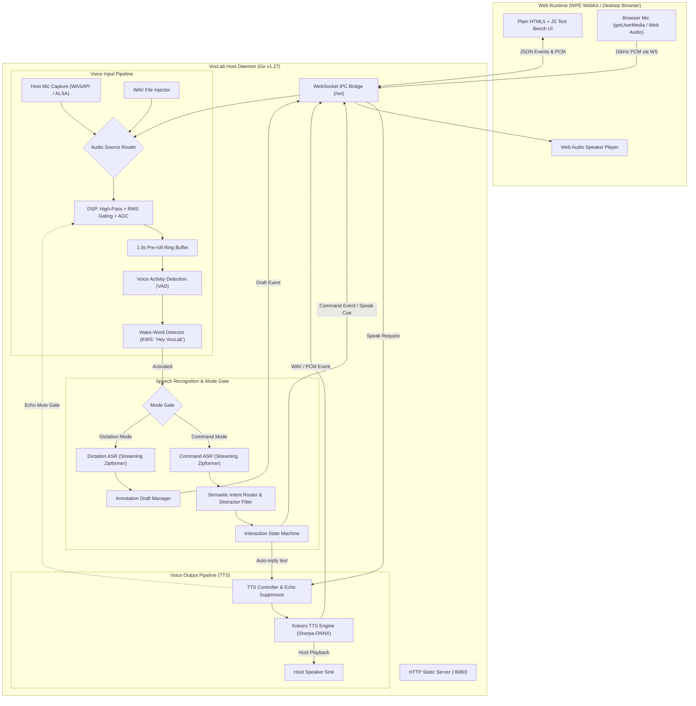

# VoxLab Architecture & Implementation Plan

VoxLab is a voice pipeline test bench for web runtimes (WPE WebKit, embedded Chromium, and desktop browsers) running on **Windows** and **Linux**. It provides an interactive laboratory to develop, inspect, benchmark, and simulate the complete offline voice input and voice output lifecycle specified in the project recipes.

---

## 1. Goal Description

Develop the complete VoxLab application according to `AGENTS.md` and reference recipes in `ref/`:

- **Backend**: Go v1.27 web server and voice API server (HTTP + WebSocket IPC).
- **Frontend**: High-density Plain HTML5 + CSS + JavaScript test bench UI.
- **Voice Input Pipeline**:
  - Dual audio input: **Web UI microphone** (Web Audio API / `getUserMedia` over WebSocket) AND **Host Go app microphone** (native OS capture) AND **Test WAV audio injection**.
  - Audio preprocessing: RMS noise floor gating, high-pass filter, software AGC, and Silero/energy VAD.
  - Optional Wake-Word Detector (Sherpa-ONNX KWS / keyword spotting) with a circular pre-roll audio ring buffer to prevent clipping speech.
  - Dual-purpose Sherpa-ONNX speech recognition:
    - **Purpose 1: Voice Commands**: Streaming ASR + semantic intent catalog matching + distractor/chatter rejection + slot extraction + confirmation policy state machine.
    - **Purpose 2: Voice Dictations**: Continuous speech transcription + live partials + silence endpointing + draft review workflow (isolated from command execution).
- **Voice Output Pipeline**:
  - Text input (manual prompt, test presets, or automated command responses).
  - Kokoro TTS engine (offline multi-speaker neural speech synthesis via Sherpa-ONNX).
  - Dual speaker output: Web UI audio playback AND Host native speaker output.
  - Half-duplex echo suppression: Inhibit voice input during device speech playback to prevent self-triggering loops.

---

## 2. User Review Required

> [!IMPORTANT]
> **Audio Input Sources: Dual Support (Web UI Mic + Host Go App Mic)**
> The user asked: `voice input from web UI mic (or host Go app?)`.
> In VoxLab, we implement **both** selectable via a toggle:
> 
> 1. **Web UI Mic**: Captured by the browser and streamed as 16kHz PCM chunks over WebSocket. Essential for browser testing and remote clients.
> 2. **Host Go App Mic**: Captured natively by the Go application directly from host hardware (ALSA / WASAPI). Essential for embedded appliances (e.g. WPE WebKit where WPE has no mic access, as described in `ref/linux-wpe-voice-recipe.md`).
> 3. **WAV File Injection**: Allows loading test audio clips to evaluate noise rejection and ASR deterministically.

> [!IMPORTANT]
> **Sherpa-ONNX Engine Strategy for Windows & Linux**
> Full neural speech models (Kokoro TTS and Zipformer ASR) are large ONNX files (~100MB to ~500MB each).
> To ensure VoxLab works **immediately out-of-the-box** without requiring gigabytes of downloads or local C++ compilers (like MSVC on Windows), VoxLab includes:
> 
> 1. **Dual Engine Mode**:
>    - **Live Sherpa-ONNX Mode**: Executes Sherpa-ONNX binaries (`sherpa-onnx-offline-tts`, `sherpa-onnx-online-websocket-server`, `sherpa-onnx-keyword-spotter`) or native C-API libraries against downloaded ONNX models.
>    - **Testbench Simulator Mode**: Built-in zero-dependency Go engine that simulates realistic ASR partial transcripts, VAD energy detection, intent scoring, and synthetic audio output for instant development and testing.
> 2. **Model Downloader Scripts & UI**: One-click scripts (`scripts/download_models.ps1` and `scripts/download_models.sh`) to fetch official Kokoro TTS and Zipformer models.

---

## 3. High-Level Architecture Diagram



---

## 4. Proposed Changes & Component Breakdown

### Component 1: Core Go Server & Configuration (`cmd/voxlab`, `pkg/config`, `pkg/server`)

#### [NEW] `go.mod`

- Module: `voxlab`
- Go version: `1.27`
- Dependencies: `github.com/gorilla/websocket` (or lightweight pure Go WebSocket implementation).

#### [NEW] `pkg/config/config.go`

- Server configuration: Port (default `8080`), Bind address (`0.0.0.0`).
- Audio configuration: Sample rate (`16000`), Channels (`1`), Frame size (`480` samples / 30ms).
- Noise filter thresholds: RMS noise floor (`-42 dBFS`), high-pass cut-off (`80 Hz`).
- Wake-word config: Keyword string (`Hey VoxLab`), trigger threshold (`0.40`), pre-roll buffer duration (`1.0s`).
- Intent scoring thresholds: Confidence threshold (`0.80`), Runner-up margin (`0.12`).
- Model paths: Directories for Kokoro TTS, Zipformer ASR, and KWS tokens.

#### [NEW] `pkg/server/server.go`

- Native HTTP file server for `web/` assets.
- WebSocket endpoint `/ws` handling full-duplex binary audio and JSON messaging.
- Session manager supporting multiple concurrent web UI client tabs with real-time broadcast and targeted RPC responses.

---

### Component 2: Audio DSP, Ring Buffering & Host Capture (`pkg/audio`)

#### [NEW] `pkg/audio/dsp.go`

- **RMS Energy Calculation**: Measures audio level in dBFS.
- **Noise Gate**: Drops or zeros audio below configured threshold (e.g. -42 dBFS) to ignore distant chatter.
- **High-Pass Filter**: 1st/2nd order IIR filter removing sub-80Hz environmental rumble.
- **Automatic Gain Control (AGC)**: Soft-knee gain normalization.
- **Echo Suppression / Half-Duplex Gate**: Software latch that inhibits audio ingestion when TTS playback is active.

#### [NEW] `pkg/audio/ringbuffer.go`

- Thread-safe circular audio ring buffer storing 1.0 second of 16kHz mono Float32 audio.
- When wake-word triggers, the pre-roll buffer is prepended to the ASR stream, ensuring words spoken immediately after activation are never clipped.

#### [NEW] `pkg/audio/capture.go`

- Audio capture abstraction interface:
  
  ```go
  type AudioSource interface {
      Start(ctx context.Context, out chan<- []float32) error
      Stop() error
  }
  ```
- Implementations:
  1. `WebSocketSource`: Ingests PCM streamed from browser mic.
  2. `HostNativeSource`: Records from host audio hardware (WASAPI on Windows, ALSA/parec on Linux).
  3. `WavFileSource`: Streams pre-recorded `.wav` files at real-time speeds for deterministic test bench evaluation.

---

### Component 3: Sherpa-ONNX & Simulator Engine (`pkg/engine`, `pkg/intent`, `pkg/tts`)

#### [NEW] `pkg/engine/engine.go`

- Unified interface for VAD, KWS, streaming ASR, and TTS:
  
  ```go
  type SpeechEngine interface {
      VAD(chunk []float32) (isVoice bool, prob float32)
      DetectWakeWord(chunk []float32) (detected bool, keyword string, confidence float32)
      StartASRStream(mode string) (ASRStream, error)
      SynthesizeKokoro(req TTSRequest) (*TTSResult, error)
  }
  ```

#### [NEW] `pkg/engine/sherpa_runner.go`

- Subprocess & CLI bridge for official Sherpa-ONNX tools:
  - Invokes `sherpa-onnx-offline-tts` with `--kokoro-model-dir`, `--kokoro-voices`, `--kokoro-tokens`.
  - Connects to `sherpa-onnx-online-websocket-server` or `sherpa-onnx-keyword-spotter`.
  - Streaming stdin/stdout IPC for low-latency processing.

#### [NEW] `pkg/engine/simulator.go`

- High-fidelity test bench simulation engine:
  - Realistic VAD voice-level calculation.
  - Simulated wake-word detection on "Hey VoxLab" or "Hey Console".
  - ASR streaming simulation: generates partial token hypotheses followed by final transcripts.
  - Built-in lightweight synthetic audio synthesizer (audio tones / chime waveforms) for Kokoro TTS testing when model weights are not yet downloaded.

#### [NEW] `pkg/intent/catalog.go` & `matcher.go`

- Command Catalog parser (`commands.json`):
  - Canonical actions: `NAV_SETTINGS`, `START_RECORDING`, `STOP_RECORDING`, `DISPLAY_DARK`, `VOLUME_UP`, `VOLUME_DOWN`, `ROUTE_VIDEO`.
  - Distractor phrases: *"what time is lunch"*, *"what are you doing"*, *"great weather outside"*, *"let us order pizza"*.
- Matcher algorithm:
  - Exact phrase match & alias dictionary.
  - Token overlap / Cosine similarity scoring.
  - Distractor suppression: If top match is in distractor catalog or top score $< 0.80$ or margin $< 0.12$, reject as chatter (`utterance_rejected`).
  - Negation detector: Rejects contradictory requests like *"do not stop recording"*.
  - Slot extraction: Resolves `source` and `destination` entities.

#### [NEW] `pkg/statemachine/state.go`

- State machine implementing `ref/linux-wpe-voice-recipe.md`:
  - States: `IDLE`, `COMMAND_LISTEN`, `PROCESS`, `CONFIRM`, `ANNOTATION_LISTEN`, `REVIEW`, `SPEAKING`, `FAULT`.
  - Handles timeouts (5s speech-start timeout, 800ms trailing silence endpoint).

#### [NEW] `pkg/tts/kokoro.go`

- Kokoro TTS manager:
  - Speaker profiles: `af_heart`, `af_alloy`, `af_aoede`, `af_bella`, `am_adam`, `am_fenrir`, `am_michael`, `am_puck`.
  - Configurable parameters: Speed (0.5x - 2.0x), volume, speaker ID.
  - Latency tracking: Computes Time-To-First-Audio (TTFA) and Real-Time Factor (RTF).
  - Emits audio chunks over WebSocket to Web UI speaker AND optionally writes to host sound device.

---

### Component 4: Web Test Bench UI (`web/index.html`, `web/css`, `web/js`)

#### [NEW] `web/index.html`

- Five-panel responsive layout:
  1. **Top Bar**: Connection status, Host OS badge (Win/Linux), Mode indicator (`IDLE`/`LISTENING`/`SPEAKING`), Global Mute.
  2. **Panel 1: Audio Input & Filter Hub**:
     - Source toggle: [Web UI Mic] / [Host App Mic] / [Test WAV Sample].
     - WebRTC constraints toggles (Noise Suppression, Echo Cancellation, AGC).
     - Noise gate threshold slider (-60 to -20 dBFS) & High-pass filter toggle.
     - Real-time oscilloscope & frequency spectrum analyzer (HTML5 Canvas).
  3. **Panel 2: Activation & Wake-Word Detector**:
     - Mode switch: [Push-to-Talk] vs [Continuous Wake-Word].
     - Wake word selector ("Hey VoxLab" / "Hey Console") & sensitivity threshold slider.
     - Ring buffer status visualizer (pre-roll buffer fill level).
     - Physical activation buttons: "Activate Command", "Start Dictation", "Cancel".
  4. **Panel 3: Speech Processing Dual-Lab**:
     - **Tab A: Voice Commands & Intent Inspector**:
       - Live ASR partial & final transcript.
       - Ranked intent table: Top Match, Confidence %, Margin %, Extracted Slots.
       - Distractor rejection counter & log.
       - Interactive command execution simulator.
     - **Tab B: Voice Dictation & Draft Studio**:
       - Continuous live transcript stream with punctuation endpointing.
       - Annotation draft review card: Word count, duration, editable textarea.
       - Annotation tag selector (`#observation`, `#urgent`, `#defect`).
       - Draft action buttons: "Save Draft", "Copy Text", "Clear".
  5. **Panel 4: Voice Synthesis (Kokoro TTS Studio)**:
     - Prompt text input with sample quick-picks.
     - Kokoro voice selector (`af_heart`, `af_bella`, `am_adam`, `am_fenrir`...).
     - Speed & volume sliders.
     - Speaker route: [Web UI Speaker] / [Host Native Speaker].
     - Audio player with waveform visualization and repeat button.
     - Half-duplex echo suppression indicator.
  6. **Panel 5: Telemetry, Benchmarks & JSON Event Stream**:
     - Real-time latency waterfall (Chunk delay, VAD latency, ASR token delay, Intent latency, TTS TTFA).
     - Raw WebSocket JSON event log with copyable payloads.

#### [NEW] `web/css/style.css`

- Dark-mode, high-contrast engineering UI inspired by audio workstations and hardware test benches.
- Animated VU meters, waveform canvas styling, glowing status rings for voice states.

#### [NEW] `web/js/audio-capture.js`

- Web Audio API pipeline: `AudioContext`, `MediaStreamAudioSourceNode`, `BiquadFilterNode`, `ScriptProcessorNode` / `AudioWorkletNode`.
- Audio conversion: downsamples to 16kHz mono Float32 / Int16 PCM.
- Real-time oscilloscope canvas drawing loop.

#### [NEW] `web/js/voice-client.js`

- Full WebSocket protocol client handling binary PCM audio frames and typed JSON events.
- Reconnection logic, keepalive ping/pong, latency tracking.

#### [NEW] `web/js/bench-ui.js`

- Binds UI controls (sliders, buttons, tabs) to WebSocket commands.
- Visualizes transcripts, intent rankings, dictation drafts, and benchmark latency waterfalls.

---

### Component 5: Automation Scripts & Model Management (`scripts/`, `data/`)

#### [NEW] `data/commands.json`

- Default command catalog with 7 canonical actions, 20+ synonyms, 4 distractor phrases, and slot definitions.

#### [NEW] `data/test_samples/`

- Sample synthetic WAV audio files for test bench injection:
  - `command_lights_on.wav`
  - `command_stop_recording.wav`
  - `dictation_sample.wav`
  - `ambient_chatter_distractor.wav`

#### [NEW] `scripts/download_models.ps1` (Windows) & `scripts/download_models.sh` (Linux)

- Downloads official Kokoro TTS model files (`model.onnx`, `voices.bin`, `tokens.txt`, `espeak-ng-data`) and streaming Zipformer ASR model files from GitHub releases into `models/`.

---

## 5. Verification Plan

### Automated Tests

1. **Audio DSP Tests**:
   - `go test -v ./pkg/audio/...`: Test RMS calculation, noise gate dropping silent chunks, high-pass filter frequency response, and circular ring buffer write/read integrity.
2. **Intent Matcher & State Machine Tests**:
   - `go test -v ./pkg/intent/...`: Test command catalog parsing, exact matches, alias matches, distractor phrase rejection, and negation detection.
   - `go test -v ./pkg/statemachine/...`: Test state transitions (`IDLE` $\to$ `COMMAND_LISTEN` $\to$ `PROCESS` $\to$ `CONFIRM`).
3. **TTS & Engine Tests**:
   - `go test -v ./pkg/engine/...`: Test simulator engine and Sherpa engine interfaces, TTS parameter validation, and audio format encoding.
4. **WebSocket Server End-to-End Tests**:
   - `go test -v ./pkg/server/...`: Test WebSocket connection lifecycle, audio chunk receipt, typed event emission, and error handling.

### Manual Verification

1. **Launch VoxLab**:
   - Run `go run ./cmd/voxlab` and open `http://localhost:8080`.
2. **Audio Input & Noise Cancelling**:
   - Speak into the Web UI mic; verify VU meter moves and oscilloscope reflects voice.
   - Turn up noise gate threshold; verify low-level background noise chunks are silenced.
3. **Wake-Word & Command Purpose**:
   - Enable Wake-Word ("Hey VoxLab"). Say "Hey VoxLab, open settings".
   - Verify wake-word detection event fires, status turns glowing blue/listening, pre-roll buffer delivers the full phrase, and Intent Inspector classifies `NAV_SETTINGS` with score $> 0.80$.
   - Test distractor rejection: Say "What time is lunch?" $\to$ verify quiet rejection (`utterance_rejected`).
4. **Voice Dictation Purpose**:
   - Switch to Dictation mode. Dictate a paragraph.
   - Verify live streaming partial transcripts appear in the draft editor, silence endpointing detects paragraph end, and no unintended commands are executed.
5. **Kokoro TTS Voice Synthesis**:
   - Type "Welcome to VoxLab. Voice pipeline initialized."
   - Select speaker `af_heart`, speed `1.0x`, click "Synthesize".
   - Verify audio plays crisply through Web UI speaker and/or host speaker, and latency waterfall shows TTFA $< 200\text{ ms}$.
   - Verify half-duplex mute latch prevents microphone feedback during TTS playback.
